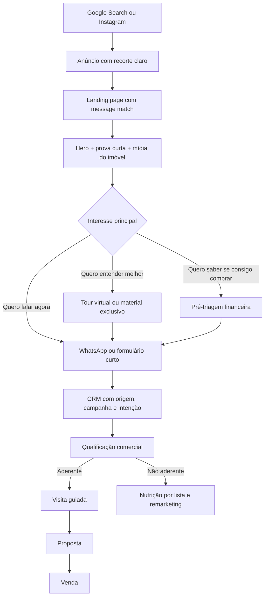
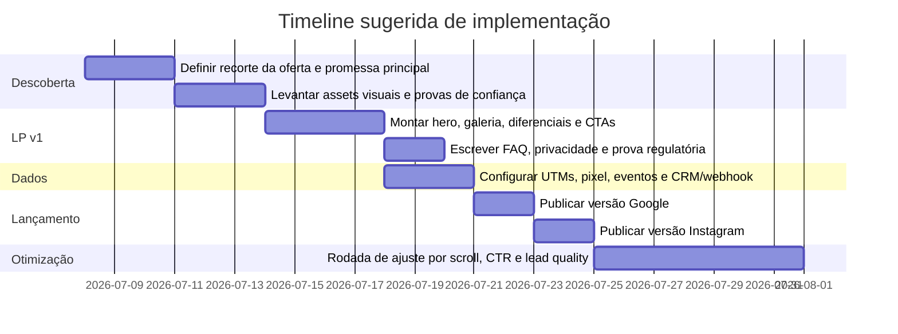

# 08/07/2026 — Blueprint independente para landing pages de corretor de imóveis voltadas ao comprador final

Fontes: template do repositório via GitHub raw, landing pages reais, sites oficiais, estudos e relatórios públicos na web

## Escopo e método

Este relatório segue o template `docs/template-blueprint.md` do repositório `AlcinoAfonso/LP-Factory-10` como fonte primária de estrutura e de critério metodológico. O próprio template exige um **Blueprint independente**, não uma LP final, e determina que toda recomendação de módulo, variante ou parâmetro cite a fonte usada ou seja marcada como **hipótese** quando a evidência pública não for suficiente. Também exige a saída organizada em 11 blocos temáticos, que foram mantidos abaixo. citeturn1view0

Como a região/mercado não foi informada, o blueprint foi construído com lógica **agnóstica de geografia**, mas toda recomendação que depende de país, estado, programa habitacional, órgão regulador, forma de financiamento ou regra publicitária foi explicitamente marcada como **dependente de mercado**. No contexto brasileiro, há implicações claras de LGPD, identificação profissional via CRECI e, para lançamentos, registro de incorporação no anúncio. citeturn15view0turn17search1turn17search4

### Resumo executivo

Para comprador final, a LP que tende a performar melhor não é a “mais bonita”, e sim a que reduz o custo cognitivo de três perguntas: **esse imóvel combina comigo, eu consigo pagar, e posso confiar em quem está me atendendo?** Essa síntese aparece tanto no comportamento do comprador residencial em estudos da NAR quanto nos padrões observados em LPs reais do setor, que concentram hero com proposta objetiva, prova visual forte, chamadas para visita/tour, captação simples de lead e sinais explícitos de confiança. citeturn8view0turn9view1turn4view0turn4view1turn4view2turn4view4

Para aquisição de leads qualificados, **Google** deve ser tratado como canal de captura de demanda já existente, porque o próprio Google posiciona lead forms como forma de alcançar usuários “no momento certo”, com campanhas orientadas a conversão, perguntas relevantes e integração rápida ao CRM. **Instagram** deve ser tratado como canal de descoberta, desejo e pré-qualificação visual; a própria Meta descreve lead generation nas suas tecnologias como um ambiente em que as pessoas estão abertas à descoberta, e recomenda formas “higher intent”, metas de leads qualificados e simplificação de formulários. citeturn18view0turn18view1turn6search0turn6search2turn6search3turn6search4turn6search9

O núcleo do blueprint, portanto, precisa combinar: **message match** entre anúncio e hero, galeria/tour como prova de produto, bloco de diferenciais objetivos, qualificação leve ou progressiva, CTA recorrente de visita e/ou atendimento, e um rodapé de confiança com privacidade e identificação profissional. Em mercados como o brasileiro, módulos de financiamento, renda e documentação ganham peso adicional, porque páginas reais e fontes oficiais colocam simulação, elegibilidade e fluxo documental como parte central da jornada. citeturn14search6turn21view0turn22search1turn22search3turn22search4turn4view2turn4view7

| Elemento estratégico | Síntese | Fonte | Status |
|---|---|---|---|
| Intenção dominante do público | Encontrar um imóvel aderente ao estilo de vida e ao orçamento, com o mínimo de fricção e risco percebido | NAR 2025; CAIXA; LPs com simulação, visita e cadastro citeturn9view1turn22search1turn4view0turn4view2 | Aprovado |
| Nível de consciência | Médio a alto no Google; médio no Instagram, onde a descoberta visual e o desejo pesam mais | Google Ads Help; Meta lead generation positioning citeturn18view1turn6search3 | Aprovado |
| Principal dor | Medo de perder tempo com imóveis genéricos ou inviáveis financeiramente | NAR; formulários de qualificação financeira; simuladores oficiais citeturn9view1turn4view2turn22search1 | Aprovado |
| Principal desejo | Clareza rápida sobre localização, tipologia, faixa de preço, diferenciais e próximo passo | Podium; Novolar; RIIO; Up Icaraí citeturn4view0turn4view1turn4view4turn4view6 | Aprovado |
| Principal objeção | “Não sei se cabe no meu orçamento” e “não sei se esse atendimento é confiável” | CAIXA; Santander; CRECI-RJ; Google privacy/lead form requirements citeturn22search1turn22search3turn2search1turn17search1turn18view1 | Aprovado |
| Principal risco percebido | Erro de decisão por pouca informação, promessa genérica, baixa transparência ou anúncio irregular | LGPD; Google Ads policies; CRECI-RJ citeturn15view0turn5search19turn17search4 | Aprovado |
| Principal gatilho de conversão | Visita guiada, tour virtual, material exclusivo, simulação de financiamento e atendimento rápido com especialista | Novolar; RIIO; Jazz; Up Icaraí; Google lead management citeturn4view0turn4view1turn4view4turn4view5turn18view0 | Aprovado |

## Mercado e referências observadas

### Padrões observados no mercado

As páginas reais observadas convergem mais para o modelo de **“produto imobiliário + especialista + captação simples”** do que para o modelo de LP puramente institucional. Em lançamentos, o padrão recorrente é exibir visuais fortes, diferenciais do empreendimento, convite para cadastro e um segundo ativo de profundidade, como tour virtual, download de apresentação ou visita guiada. Em páginas mais amplas de imobiliária, aparece um padrão adicional: recortes por região, objetivo de compra e tipologia, o que sugere que a LP do corretor voltada ao comprador final deve sempre deixar claro **para quem a página serve** e **qual recorte do portfólio ela cobre**. citeturn4view0turn4view1turn4view4turn4view5turn4view6

Um segundo padrão forte é a centralidade do visual. A NAR aponta que 52% dos compradores encontraram o imóvel comprado online e que 81% classificaram fotos do imóvel como o recurso mais útil durante a busca online. Isso reforça que, nesse nicho, imagem não é ornamento: é parte do argumento de venda. citeturn21view0turn8view0

Um terceiro padrão é a busca por **sinais de segurança**: política de privacidade em formulário, endereço/telefone, identidade do corretor, especialização territorial, marca da incorporadora/construtora e, no Brasil, exibição de CRECI e de dados de incorporação quando aplicável. citeturn4view0turn4view2turn4view3turn17search1turn17search4turn18view1turn15view0

#### Tabela comparativa de referências reais

| Referência | Ângulo principal | Oferta / CTA | Captação | Provas e confiança | Padrão reutilizável |
|---|---|---|---|---|---|
| Novolar Atlanta | Lançamento com benefícios concretos e lazer | “Cadastre-se e saiba tudo sobre o lançamento”; “Saiba mais sobre o seu novo apartamento”; download de presentation; tour virtual | Formulário simples repetido em mais de um ponto | Política de privacidade; diferenciais objetivos; imagens do projeto e lazer | Repetição de captação, tour e material rico citeturn4view0 |
| RIIO by Piero Lissoni | Imóvel/lançamento premium com especialista | “Cadastre-se e receba atendimento personalizado”; “Quero o RIIO...” | CTA de alta intenção | Autoridade pelo posicionamento de especialista regional e apelo aspiracional | Hero premium + especialista + CTA direto citeturn4view1 |
| Minha Casa Minha Vida RJ | Financiamento e elegibilidade | “Simular financiamento” | Questionário qualificatório | Endereço, e-mail, telefone, CRECI; promessa de contato do analista | Fluxo de pré-qualificação financeira citeturn4view2 |
| Up Icaraí | Desejo visual + antecipação de lançamento | “Saiba mais”; “cadastre-se abaixo e se antecipe ao lançamento” | Formulário simples | Tour virtual; imagens fortes; benefício central claro | Hero visual com captação tardia após aquecimento citeturn4view4 |
| Jazz by Housi | Lifestyle urbano e exclusividade | “Receba agora mais informações com exclusividade” | Formulário simples | Narrativa de estilo de vida e localização | Variante lifestyle para Instagram e tráfego frio citeturn4view5 |
| Podium Imóveis | Escolha por objetivo e região | “Comprar imóvel”; “Lançamentos”; “Fale com um especialista” | Navegação/segmentação antes do contato | Portfólio, recorte regional, especialização em alto padrão | Variante portfólio/região para corretor com estoque amplo citeturn4view6 |

#### Intenções de busca e dúvidas prováveis do comprador final

Sem um export de Keyword Planner, volumes e hierarquia exata de termos devem ser tratados como **hipótese**. Ainda assim, os padrões de navegação e copy das páginas reais permitem inferir com segurança os seguintes clusters de intenção. citeturn4view0turn4view1turn4view2turn4view4turn4view6

| Cluster de intenção | Exemplos de formulação | Evidência pública | Status |
|---|---|---|---|
| Localização + tipologia | “apartamento 2 quartos [bairro]”, “cobertura [região]”, “lançamentos [bairro]” | Podium organiza a navegação por região e tipologia; várias páginas de lançamentos destacam bairro/região logo no topo citeturn4view6turn2search10turn2search14 | Aprovado |
| Estágio do imóvel | “na planta”, “pré-lançamento”, “pronto para morar”, “lançamento” | Padrão visível em Podium, Vilaurbe e páginas de lançamentos citeturn4view6turn2search0turn3search1 | Aprovado |
| Viabilidade financeira | “simular financiamento”, “Minha Casa Minha Vida”, “entrada”, “FGTS” | CAIXA, Santander, Plano&Plano e MCMV RJ colocam simulação e elegibilidade no centro da jornada citeturn22search1turn22search3turn2search1turn4view2turn4view7 | Aprovado |
| Visita / exploração do produto | “tour virtual”, “visita guiada”, “planta”, “book do empreendimento” | Novolar, RIIO, Up Icaraí e Jazz usam tour, visita ou material exclusivo como CTA de aprofundamento citeturn4view0turn4view1turn4view4turn4view5 | Aprovado |
| Credibilidade do atendimento | “especialista em lançamentos”, “CRECI”, “imobiliária em [cidade]” | RIIO, Podium, sites com depoimentos e páginas com CRECI visível reforçam autoridade e confiança citeturn4view1turn4view2turn20search2turn20search20 | Aprovado |
| Dúvidas jurídicas/documentais | “registro da incorporação”, “documentação”, “aprovação de crédito” | CRECI-RJ exige número da incorporação para lançamento e identificação do CRECI em anúncios citeturn17search4turn17search1 | Aprovado |

## Blueprint estrutural

### Módulos recomendados

| Módulo conceitual | Função no funil | Quando usar | Quando evitar | Objeção que resolve | Ação esperada | Universal ou específico | Prioridade | Fonte | Status |
|---|---|---|---|---|---|---|---|---|---|
| Hero com recorte explícito | Fazer message match entre anúncio e página | Sempre, sobretudo em Google | Nunca em páginas de captação principal | “Caí numa página genérica” | Continuar a leitura ou clicar no CTA principal | Universal | Alta | Google recomenda correspondência entre anúncio, palavra-chave e LP; exemplos reais usam recorte claro do produto citeturn14search6turn4view1turn4view4 | Aprovado |
| Mídia principal do imóvel | Transformar interesse abstrato em desejo concreto | Sempre | Só evitar se a página ainda não tiver material visual mínimo | “Não consigo imaginar o produto” | Navegar nas imagens/tour | Universal | Alta | Fotos são o recurso mais útil para 81% dos compradores; LPs usam galeria e tour com frequência citeturn21view0turn4view0turn4view4turn4view5 | Aprovado |
| Bloco de diferenciais objetivos | Reduzir leitura dispersa e acelerar comparação | Sempre | Evitar quando não houver diferenciais verificáveis | “O que esse imóvel tem de especial?” | Scrolar e qualificar interesse | Universal | Alta | Novolar lista diferenciais e lazer de forma objetiva; compradores buscam compatibilidade com o estilo de vida citeturn4view0turn21view0 | Aprovado |
| Prova territorial / localização | Tornar a oferta específica | Em páginas por bairro, cidade ou região | Evitar em página nacional sem recorte local | “A localização serve para mim?” | Clicar em mapa, tour, rota ou continuar | Quase universal | Alta | Podium segmenta por região; NAR aponta qualidade do bairro como fator relevante citeturn4view6turn8view0 | Aprovado |
| Qualificação leve inicial | Captar lead sem matar volume | Google e Instagram com tráfego frio/morno | Evitar em fundo de funil quando falta filtro | “Ainda não quero preencher tudo” | Nome + telefone + e-mail + CTA | Universal | Alta | Meta pede formulários simples; Google pede perguntas relevantes e claras citeturn6search0turn18view0 | Aprovado |
| Qualificação progressiva de financiamento | Separar curiosos de oportunidades reais | Produto econômico, MCMV, comprador sensível a crédito | Evitar acima da dobra no Instagram frio | “Não sei se consigo financiar” | Responder perguntas de renda/FGTS/tempo de trabalho | Específico por cenário | Alta | CAIXA, Santander e páginas MCMV enfatizam simulação; LP real usa perguntas qualificatórias citeturn22search1turn22search3turn2search1turn4view2 | Aprovado |
| CTA de visita guiada / tour | Empurrar o lead para uma microconversão mais qualificada | Quando houver decorado, tour 360 ou possibilidade de visita | Evitar se o time não consegue cumprir o agendamento | “Preciso ver melhor antes de falar” | Agendar visita/tour | Universal | Alta | RIIO, Novolar e outras páginas reais usam visita e tour como CTA central citeturn4view0turn4view1turn3search10 | Aprovado |
| Bloco de especialista / corretor | Transferir confiança do imóvel para o atendimento | Sempre em LP de corretor | Só evitar se a operação for puramente marca/projeto | “Posso confiar em quem vai me atender?” | Clicar em WhatsApp ou enviar lead | Universal | Alta | RIIO e Podium usam especialização; NAR mostra que 88% dos compradores usam agente/corretor citeturn4view1turn4view6turn9view1 | Aprovado |
| FAQ de risco percebido | Diminuir objeções repetidas | Sempre, especialmente Google | Evitar FAQ longa e genérica | “Preço, documentação, financiamento, prazo?” | Sanar dúvida e converter | Universal | Média | O próprio comportamento observado sugere dúvidas recorrentes; reguladores e bancos concentram temas de privacidade, financiamento e elegibilidade citeturn22search14turn15view0turn17search4 | Aprovado |
| Prova social de atendimento | Aumentar confiança interpessoal | Quando houver avaliações reais, depoimentos e prints verificáveis | Evitar se não houver prova genuína | “Esse corretor entrega?” | Prosseguir para contato | Universal | Média | Sites imobiliários reais exibem depoimentos; no recorte de LPs puras, a evidência é menos frequente citeturn20search2turn20search3turn20search20 | Hipótese |
| Rodapé de compliance e confiança | Fechar a página com segurança jurídica e institucional | Sempre | Nunca | “Meus dados vão para onde?” | Enviar formulário com mais segurança | Universal | Alta | Google exige política de privacidade em lead form; LGPD exige base legal, clareza e finalidade; no Brasil anúncios exigem CRECI e, em lançamentos, incorporação citeturn18view1turn15view0turn17search1turn17search4 | Aprovado |

### Variantes recomendadas

| Módulo pai | Variante | Cenário de uso | Campos necessários | Campos opcionais | Comportamento mobile | Riscos de uso | Reutilizável em outros nichos | Fonte | Status |
|---|---|---|---|---|---|---|---|---|---|
| Hero | Hero de imóvel único | Campanha para um empreendimento ou imóvel específico | título, subtítulo, mídia principal, CTA | prova curta, badge de estágio | CTA acima da dobra | Fica estreito demais para estoque amplo | Sim | RIIO; Up Icaraí; Google message match citeturn4view1turn4view4turn14search6 | Aprovado |
| Hero | Hero de portfólio regional | Corretor com várias opções e forte atuação local | título, seletor de região/objetivo, CTA | cards de tipologia | menus curtos e seleção rápida | Pode dispersar se virar mini-portal | Sim | Podium citeturn4view6 | Aprovado |
| Captação | Formulário simples | Instagram e tráfego frio | nome, telefone ou WhatsApp, e-mail | bairro de interesse | formulário curto em 1 tela | Muito volume com baixa qualificação | Sim | Meta e Google recomendam simplicidade/relevância; Novolar usa trio básico citeturn6search0turn18view0turn4view0 | Aprovado |
| Captação | Formulário higher intent | Google fundo de funil ou remarketing | nome, telefone, e-mail, interesse, etapa de compra | renda, FGTS, prazo | progressivo, em etapas | Queda de conversão se usado cedo demais | Sim | Meta “higher intent”; Google qualifying responses citeturn6search2turn18view0 | Aprovado |
| Oferta | Download de apresentação / book | Lançamentos e produtos com material rico | CTA, formulário simples | checkbox de interesse | entrega imediata pós-form | Gera lead curioso se o material não filtra | Sim | Novolar Atlanta oferece presentation citeturn4view0 | Aprovado |
| Oferta | Tour virtual / tour do decorado | Produto com visual forte | CTA de tour, embed ou link | captação antes do tour | preview visual e botão grande | Tour ruim derruba percepção de qualidade | Sim | Novolar, Up Icaraí, Jazz citeturn4view0turn4view4turn4view5 | Aprovado |
| Oferta | Visita guiada | Tráfego mais quente e imóveis premium | CTA, agenda ou formulário | faixa de horário | botão fixo ou recorrente | Operação interna precisa responder rápido | Sim | RIIO e páginas imohoo usam visita guiada citeturn4view1turn3search14 | Aprovado |
| Qualificação | Simulação de financiamento / pré-triagem | Comprador dependente de crédito | renda, FGTS, vínculo de trabalho, dependentes | valor do imóvel e entrada | wizard em etapas | Só faz sentido pleno em mercados com produto financiado | Parcial | CAIXA, Santander, MCMV RJ, Plano&Plano citeturn22search1turn2search1turn4view2turn4view7 | Aprovado |
| Prova | Depoimentos de compradores | Operações com histórico forte de atendimento | nome, mini relato, data | foto, vídeo, Google review | carrossel simples, sem autoplay | Se parecer fabricado, destrói confiança | Sim | Kloh, Walker, Andrade Imóveis citeturn20search2turn20search3turn20search20 | Hipótese |
| CTA | WhatsApp rápido com especialista | Tráfego mobile e operação consultiva | botão, número, promessa de resposta | mensagem pré-preenchida | sticky bottom | Pode drenar mensuração se não houver tracking | Sim | Podium e múltiplos sites imobiliários usam contato com especialista/WhatsApp citeturn4view6turn3search8turn3search4 | Aprovado |

### Mapa seção -> módulo/variante -> parâmetros

#### Estrutura recomendada para campanha em Google

| Seção | Módulo/variante sugerida | Parâmetros principais | Fonte usada | Status |
|---|---|---|---|---|
| Hero | Hero de imóvel único ou portfólio regional | recorte de busca, localização, tipologia, faixa de preço quando pública, CTA | Google Ads LP match; RIIO; Podium citeturn14search6turn4view1turn4view6 | Aprovado |
| Prova curta | Bloco de confiança imediato | especialista, CRECI, política de privacidade, marca parceira | RIIO; MCMV RJ; Google lead form; CRECI-RJ citeturn4view1turn4view2turn18view1turn17search1 | Aprovado |
| Vitrine do produto | Galeria/tour | 5–12 imagens úteis, preview do tour, plantas | NAR; Novolar; Up Icaraí citeturn21view0turn4view0turn4view4 | Aprovado |
| Diferenciais | Cards objetivos | metragem, quartos, localização, lazer, estágio | Novolar; páginas de lançamento reais citeturn4view0turn2search10 | Aprovado |
| Finanças | Simulador ou pré-triagem curta | renda, entrada, FGTS, faixa de valor | CAIXA; Santander; MCMV RJ citeturn22search1turn2search1turn4view2 | Aprovado |
| CTA intermediário | Visita guiada / WhatsApp | agendar, falar com especialista | RIIO; Podium citeturn4view1turn4view6 | Aprovado |
| FAQ | FAQ de objeções | financiamento, documentação, localização, prazo, privacidade | CAIXA; LGPD; CRECI-RJ citeturn22search14turn15view0turn17search4 | Aprovado |
| Conversão final | Formulário higher intent | nome, telefone, e-mail, interesse, etapa da compra | Google lead forms best practices citeturn18view0 | Aprovado |
| Footer | Compliance | política de privacidade, identificação profissional, contatos | Google; LGPD; CRECI-RJ citeturn18view1turn15view0turn17search1 | Aprovado |

#### Estrutura recomendada para campanha em Instagram

| Seção | Módulo/variante sugerida | Parâmetros principais | Fonte usada | Status |
|---|---|---|---|---|
| Hero | Hero lifestyle + recorte | headline curta, visual forte, promessa de descoberta | Jazz; Up Icaraí; Dash Social insight sobre conteúdo aspiracional citeturn4view4turn4view5turn11view1 | Aprovado |
| Prova visual | Reel-style gallery / carrossel | imóveis, arredores, amenities, lifestyle | Dash Social; NAR fotos citeturn11view1turn21view0 | Aprovado |
| Localização | Bloco de bairro e conveniência | mapa, proximidades, estilo de vida | NAR neighborhood factors; páginas com foco regional citeturn8view0turn4view6 | Aprovado |
| Oferta | Tour / material exclusivo | “receba mais informações”, “tour do decorado” | Novolar; Jazz citeturn4view0turn4view5 | Aprovado |
| Captação | Formulário simples | nome, telefone, e-mail | Meta simplificação; LPs reais citeturn6search0turn4view0 | Aprovado |
| Nutrição | WhatsApp ou Messenger pós-cadastro | link rastreado, script de triagem | Meta lead nurturing/tracking params; operação consultiva observada no setor citeturn6search10turn18view6 | Aprovado |
| Footer | Privacidade e confiança | política, corretor, contatos | LGPD; Google/Meta requirements; CRECI | citeturn15view0turn18view1turn17search1 | Aprovado |

#### Estrutura recomendada para cenário financiamento-first

| Seção | Módulo/variante sugerida | Parâmetros principais | Fonte usada | Status |
|---|---|---|---|---|
| Hero | Hero com elegibilidade | programa/linha de crédito, benefício central, CTA de simulação | CAIXA; Santander; MCMV RJ citeturn22search0turn22search1turn2search1turn4view2 | Aprovado |
| Pré-triagem | Wizard em etapas | renda, FGTS, vínculo, dependentes | MCMV RJ; Plano&Plano citeturn4view2turn4view7 | Aprovado |
| Explicação | “Como funciona” | passos, documentos, análise, prazo | Santander; CAIXA citeturn2search1turn22search4 | Aprovado |
| Conversão | Agente/analista | recebimento de contato humano | MCMV RJ “Você receberá o contato de um dos nossos analistas” citeturn4view2 | Aprovado |

## Copy, UX e qualidade

### Parametrização editorial por campo

Os parâmetros abaixo priorizam clareza, especificidade e promessa verificável. Onde há recomendação de tom ou limite sem norma pública explícita, a indicação foi construída por síntese entre Google Ads, LGPD e padrões reais de LPs do setor; portanto o parâmetro é **hipótese operacional**, não regra jurídica. citeturn18view0turn14search6turn15view0turn4view0turn4view1

| Campo | Limite recomendado | Fonte estratégica recomendada | Tom | Promessa permitida | O que evitar | Exemplo bom | Exemplo ruim | Fonte | Status |
|---|---|---|---|---|---|---|---|---|---|
| Hero title | 45–80 caracteres | consulta do anúncio + recorte do imóvel | direto e específico | benefício concreto e verificável | abstração vazia | “Apartamentos na planta em Copacabana com tour e atendimento especializado” | “O imóvel dos seus sonhos está aqui” | Google message match; páginas reais por local e tipologia citeturn14search6turn4view1turn3search6 | Hipótese operacional |
| Hero subtitle | 90–160 caracteres | diferenciais, localização, próximo passo | informativo | explicação do valor da oferta | excesso de adjetivos | “Veja plantas, diferenciais e condições de compra antes de agendar sua visita.” | “Uma experiência única, inesquecível e imperdível.” | Novolar; RIIO; Google lead form creative citeturn4view0turn4view1turn18view0 | Hipótese operacional |
| CTA principal | 14–28 caracteres | microconversão mais valiosa | imperativo claro | ação específica | CTA genérico | “Agendar visita guiada” | “Enviar” | Google e Meta recomendam CTA claro; LPs usam visita/tour/cadastro como verbos específicos citeturn18view0turn6search0turn4view1turn4view0 | Aprovado |
| CTA secundário | 14–30 caracteres | aprofundamento sem fricção | leve | pedir mais informação | competição com CTA principal | “Ver tour virtual” | “Saiba mais” | Novolar e Up Icaraí usam tour; CTA secundário ambíguo aparece menos forte citeturn4view0turn4view4 | Aprovado |
| Prova curta | 40–90 caracteres | autoridade ou prova regulatória | seguro | especialização, CRECI, marca parceira | superlativo sem prova | “Especialista em lançamentos na Zona Sul e Barra” | “O melhor corretor do Brasil” | RIIO; CRECI-RJ; MCMV RJ citeturn4view1turn17search1turn4view2 | Aprovado |
| Título de seção | 25–60 caracteres | dúvida ou motivação do usuário | claro | antecipação do conteúdo | metáfora vaga | “Veja o que faz este imóvel valer a visita” | “Um novo horizonte para você” | NAR descrição clara; páginas reais orientadas a benefício citeturn21view0turn4view0 | Hipótese operacional |
| Descrição de card | 60–120 caracteres | dado objetivo | factual | atributo do produto | texto institucional | “2 elevadores por torre e excelente localização” | “A sofisticação que você merece” | Novolar Atlanta diferenciais citeturn4view0 | Aprovado |
| FAQ question | 45–90 caracteres | objeções repetidas do mercado | coloquial e objetiva | pergunta concreta | FAQ filosófica | “Posso simular financiamento antes da visita?” | “Por que nos escolher?” | CAIXA; MCMV; dúvidas práticas do setor citeturn22search14turn4view2 | Aprovado |
| FAQ answer | 90–220 caracteres | esclarecimento + próximo passo | transparente | condicionalidade clara | garantia indevida | “Sim. A análise depende do seu perfil e das regras da instituição financeira.” | “Sim, sua aprovação é garantida.” | CAIXA; Santander; Google clarity; LGPD transparency citeturn22search1turn2search1turn5search19turn15view0 | Aprovado |
| Formulário / pergunta de qualificação | 20–80 caracteres por pergunta | mínimo necessário para triagem | humano e simples | coleta pertinente ao objetivo | perguntas demais cedo demais | “Em que etapa da compra você está?” | “Descreva todos os detalhes da sua situação” | Meta simplificação; Google relevant questions; MCMV RJ qualificação citeturn6search0turn18view0turn4view2 | Aprovado |
| Nota de privacidade / confiança | 80–180 caracteres | base legal e finalidade | clara e visível | uso específico dos dados | consentimento genérico | “Seus dados serão usados para contato sobre este imóvel e opções relacionadas, conforme nossa política de privacidade.” | “Ao continuar você aceita tudo.” | LGPD art. 8 e 9; Google privacy requirement citeturn15view0turn18view1 | Aprovado |

#### Copy points, provas sociais e ofertas prioritárias

| Categoria | Recomendações | Fonte | Status |
|---|---|---|---|
| Copy points | localização específica; tipologia; metragem/amenities; estágio do imóvel; próximo passo tangível | NAR; Podium; Novolar; páginas de lançamentos citeturn21view0turn4view0turn4view6 | Aprovado |
| Provas sociais | CRECI; especialização por região; marca da incorporadora/construtora; endereço e telefone; depoimentos reais quando houver | MCMV RJ; RIIO; Novolar; CRECI-RJ; Kloh/Andrade citeturn4view2turn4view1turn4view3turn17search1turn20search2turn20search20 | Aprovado |
| Ofertas de captura | tour virtual; material exclusivo; visita guiada; simulação de financiamento; atendimento com especialista | Novolar; RIIO; Jazz; CAIXA; Santander citeturn4view0turn4view1turn4view5turn22search1turn2search1 | Aprovado |

### Parametrização visual e UX

| Tema | Recomendação | Fundamentação | Fonte | Status |
|---|---|---|---|---|
| Hierarquia visual | Hero com 1 mensagem principal, 1 CTA principal, 1 CTA secundário | Reduz dispersão e melhora message match | Google Ads LP match; páginas reais bem recortadas citeturn14search6turn4view1turn4view4 | Aprovado |
| Densidade | Acima da dobra: baixa a média; metade da página: média; evitar blocos longos de texto | Comprador imobiliário decide por varredura visual e comparação | NAR sobre fotos e descrições; LPs do setor usam blocos curtos | citeturn21view0turn4view0turn4view4 | Hipótese operacional |
| Uso de imagens | Priorizar imagens do imóvel, planta, fachada, decorado, vista e entorno; não usar banco genérico como peça central | Fotos são o recurso mais útil para a maioria dos compradores online | NAR 81% listing photos citeturn21view0 | Aprovado |
| Uso de ícones | Usar para diferenciais objetivos, não para decorar | Ícones ajudam escaneabilidade quando ancorados em atributos concretos | Novolar usa ícones atrelados a diferenciais mensuráveis citeturn4view0 | Aprovado |
| Prova social | Inserir prova curta perto do primeiro CTA; prova longa mais abaixo | Credibilidade deve aparecer antes da primeira decisão de contato | RIIO, MCMV RJ, CRECI-RJ, LGPD citeturn4view1turn4view2turn17search1turn15view0 | Aprovado |
| CTA fixo ou recorrente | Em mobile, repetir CTA em 3–5 pontos; sticky CTA é recomendável, mas depende de teste | Google pede facilidade de contato e navegação simples em mobile; sticky em si é inferência de CRO | citeturn14search6turn14search14 | Hipótese |
| Formulário | Começar com o mínimo necessário; se precisar qualificar, usar etapas ou perguntas condicionais | Google e Meta recomendam perguntas relevantes e simplificação/higher intent | citeturn18view0turn6search0turn6search2 | Aprovado |
| Mobile | Otimizar thumb zone, botões largos, compressão de mídia, sem pop-ups invasivos | Google destaca mobile-friendliness e facilidade de contato | citeturn14search6turn14search2 | Aprovado |
| Velocidade/performance | Tratar performance como parte da conversão; mirar CWV bons | web.dev relaciona performance a conversão; CWV: LCP ≤ 2,5 s, INP ≤ 200 ms, CLS ≤ 0,1 | citeturn5search2turn14search5 | Aprovado |
| Acessibilidade básica | Rótulos claros em formulário, contraste legível, foco visível e texto alternativo útil | W3C recomenda labels identificáveis e contraste mínimo | citeturn14search0turn14search8turn14search12 | Aprovado |

### Critérios de qualidade

| Critério | A LP parece boa quando… | Sinais de alerta | Fonte |
|---|---|---|---|
| Moderna | visual atual, imagens grandes, recorte claro, CTA nítido, navegação curta | excesso de texto institucional e layout congestionado | LPs reais de lançamentos e alto padrão citeturn4view0turn4view1turn4view5 |
| Confiável | exibe corretor/especialista, política de privacidade, contatos e, no Brasil, CRECI | formulário sem política; sem identidade profissional | Google lead forms; LGPD; CRECI-RJ citeturn18view1turn15view0turn17search1 |
| Específica | deixa explícito bairro, tipologia, faixa de produto ou público-alvo | linguagem que serviria para qualquer mercado | Google message match; Podium segmentação citeturn14search6turn4view6 |
| Persuasiva | conecta desejo com próximo passo concreto | CTA vaga, sem microconversão clara | Google/Meta CTA clarity; RIIO/Novolar citeturn18view0turn6search0turn4view1turn4view0 |
| Segura | informa uso de dados, evita promessa enganosa, respeita regras locais | promessa de aprovação garantida, valorização garantida, “sem burocracia” sem contexto | LGPD; Google ad destination/policy; CAIXA/Santander condicionam análise de crédito citeturn15view0turn5search19turn22search1turn2search1 |
| Não genérica | mostra diferenciais reais, imagens próprias, prova de autoridade local | banco de imagens e slogans vazios | NAR sobre fotos; LPs reais do setor citeturn21view0turn4view0turn4view4 |
| Pronta para teste | tem tracking, conversão definida, integração de leads e uma hipótese clara por canal | “subir a página e ver no que dá” | Google recomenda tracking, webhook/CRM e atribuição orientada a dados citeturn18view0 |

## Conversão, métricas e roadmap

Para este nicho, a medição deve separar **métrica de mídia** de **métrica da LP**. Google já oferece referências mais maduras para search ads imobiliários; Instagram tem melhores referências públicas em conteúdo/engajamento do que em CPL imobiliário. Onde não há benchmark oficial/nicho-específico suficiente, a recomendação abaixo foi marcada como **referência de mercado observada** ou **hipótese**. citeturn12view0turn12view1turn12view2turn12view3turn11view1turn13view1

#### Benchmarks e KPIs

| Camada | KPI | Referência | Leitura recomendada | Fonte | Confiança |
|---|---|---|---|---|---|
| Google Search mídia | CTR | 8,43% em Real Estate | Bom benchmark de clique para search ads do setor; base majoritariamente EUA | WordStream 2025 citeturn12view0turn12view2 | Média |
| Google Search mídia | CPC | US$ 2,53 em Real Estate | Útil para planejamento relativo, não para orçamento local direto | WordStream 2025 citeturn12view0 | Média |
| Google Search mídia | CVR | 3,28% em Real Estate | Referência de conversão search do setor; tende a variar muito por oferta e LP | WordStream 2025 citeturn12view0 | Média |
| Google Search mídia | CPL | US$ 100,48 em Real Estate | Usar só como referência internacional de ordem de grandeza | WordStream 2025 citeturn12view0turn12view3 | Média |
| LP pós-clique geral | Mediana de conversão | 6,6% all industries | Serve como faixa-base para LPs de captura em geral | Unbounce 2024 citeturn13view1 | Média |
| LP pós-clique paid search geral | CVR paid search | 10,9% em média | Referência ampla; não nicho-específica | Unbounce 2024 citeturn13view1 | Média-baixa |
| LP pós-clique Google geral | CVR Google | 11,3% em média | Referência ampla para LPs vindas de Google, não do mercado imobiliário exclusivamente | Unbounce 2024 citeturn13view1 | Média-baixa |
| Instagram orgânico | Engagement rate real estate | 0,3% média; 0,6%–0,9% top brands do recorte | Bom para benchmark de conteúdo e criativo orgânico, não de captura final | Dash Social H1 2025 citeturn11view1 | Média |
| Instagram paid social LP geral | CVR Instagram | 17,9% média paid social Instagram across industries | Referência ampla pós-clique; não nicho-específica para imobiliário | Unbounce 2024 citeturn13view1 | Baixa |
| Meta lead quality | % leads qualificados | Sem benchmark público robusto de nicho | Medir internamente por CRM e usar objetivo de qualified leads | Meta Help snippet citeturn6search4 | Baixa |

#### Dashboard mínimo recomendado

| Indicador | Por que medir | Fonte de decisão | Status |
|---|---|---|---|
| CTR por anúncio e por promessa | Valida se o recorte da oferta chama o público certo | Google Search / Instagram | Aprovado |
| Taxa de scroll até bloco de prova e até formulário | Mostra onde o interesse cai | LP analytics | Hipótese operacional |
| Taxa de clique em tour/visita/WhatsApp | Mede microconversão e intenção | LP analytics + UTMs | Aprovado |
| Conversão em lead bruto | Base do canal | CRM / pixel / GA | Aprovado |
| Lead qualificado por fonte | Mais importante do que lead bruto em real estate | CRM com estágio de qualificação | Aprovado |
| Tempo até primeiro contato | Impacta aproveitamento do lead | CRM / automação | Hipótese operacional |
| % visita agendada por lead | Ponte entre marketing e venda | CRM | Aprovado |
| % proposta por visita | Diagnostica qualidade do lead e aderência do produto | CRM | Aprovado |
| % leads com financiamento viável | Essencial quando crédito é barreira | formulário / CRM | Aprovado |

O fluxo abaixo traduz a lógica recomendada para um funil de lead qualificado: captação com message match, microconversão útil, integração rápida ao CRM e triagem por estágio de compra/financiamento. Isso está alinhado às recomendações do Google para lead management, tracking e otimização orientada a conversão, e ao posicionamento da Meta de descoberta + qualificação. citeturn18view0turn18view1turn6search3turn6search4

A timeline abaixo é um plano de implementação recomendado, não um dado de mercado. Ela prioriza o que mais afeta conversão cedo: recorte da oferta, prova visual, conformidade, mensuração e velocidade de resposta. Essa priorização é coerente com o template, com Google Ads e com as recomendações de performance e usabilidade. citeturn1view0turn18view0turn14search6turn5search2

### Lacunas prováveis no catálogo de módulos

| Lacuna provável | Por que importa neste nicho | Classificação | Fonte | Status |
|---|---|---|---|---|
| Módulo de qualificação financeira adaptativa | Crédito pesa muito na decisão; versões por renda/FGTS/etapa melhoram qualificação | Criar agora | CAIXA, Santander, MCMV RJ, Plano&Plano citeturn22search1turn2search1turn4view2turn4view7 | Aprovado |
| Módulo de prova regulatória brasileira | Exibição de CRECI e incorporação melhora confiança e atende regra local | Criar agora | CRECI-RJ; LGPD; Google privacy requirement citeturn17search1turn17search4turn15view0turn18view1 | Aprovado |
| Módulo de tour virtual + gate opcional | Muito recorrente em lançamentos e ajuda na transição entre curiosidade e lead | Criar agora | Novolar; Up Icaraí; Jazz citeturn4view0turn4view4turn4view5 | Aprovado |
| Módulo de prova territorial | Bairro/localização pesa na decisão e precisa de estrutura própria | Criar agora | Podium; NAR neighborhood factors citeturn4view6turn8view0 | Aprovado |
| Módulo de agenda de visita | Faz a ponte entre lead e próximo passo de venda real | Avaliar com mais nichos | RIIO e outras páginas com visita guiada citeturn4view1turn3search14 | Aprovado |
| Módulo de sticky CTA multicanal | Pode elevar contato mobile, mas precisa teste e não tem evidência setorial direta suficiente | Parametrizar módulo existente | Google mobile/contact ease citeturn14search6turn14search14 | Hipótese |
| Módulo de depoimentos verificáveis | Útil para confiança, mas menos presente nas LPs puras analisadas | Avaliar com mais nichos | Kloh, Walker, Andrade citeturn20search2turn20search3turn20search20 | Hipótese |
| Módulo de comparação de unidades / plantas | Pode ser decisivo em lançamentos com múltiplas opções | Avaliar com mais nichos | presença indireta em páginas de lançamentos e tour/planta citeturn4view0turn3search10 | Hipótese |

### Decisões recomendadas

#### Módulos universais que deveriam existir

| Recomendação | Justificativa | Fonte |
|---|---|---|
| Hero com recorte do imóvel/oferta | Essencial para message match e redução de bounce | citeturn14search6turn4view1 |
| Galeria/tour | Imagem é decisiva na busca imobiliária | citeturn21view0turn4view0 |
| Diferenciais objetivos | Facilita comparação e leitura rápida | citeturn4view0 |
| Formulário progressivo | Equilibra volume e qualificação | citeturn18view0turn6search2 |
| Prova de especialista | Comprador ainda depende fortemente de corretor/agente | citeturn9view1turn4view1 |
| FAQ de objeções | Reduz atrito de financiamento, documentação e próxima etapa | citeturn22search14turn17search4 |
| Rodapé de compliance | Necessário para confiança e conformidade | citeturn18view1turn15view0turn17search1 |

#### Variantes prioritárias

| Variante | Melhor canal | Motivo |
|---|---|---|
| Hero de imóvel único | Google | Captura intenção específica e melhora aderência anúncio-página citeturn14search6turn4view1 |
| Hero lifestyle + visual | Instagram | Funciona melhor em descoberta e desejo citeturn6search3turn11view1turn4view5 |
| Formulário simples | Instagram | Preserva volume e reduz fricção inicial citeturn6search0turn4view0 |
| Formulário higher intent | Google remarketing/fundo | Filtra melhor oportunidades reais citeturn18view0turn6search2 |
| Pré-triagem financeira | Faixa econômica / MCMV / crédito | Resolve objeção crítica de viabilidade citeturn22search1turn4view2 |
| Visita guiada | Premium e alto interesse | Aproxima marketing da venda efetiva citeturn4view1turn3search14 |

#### Parametrizações críticas

| Ponto crítico | Recomendação |
|---|---|
| Promessa | Nunca prometer aprovação ou valorização garantida; usar linguagem condicional e verificável. citeturn5search19turn22search1turn2search1 |
| Prova legal no Brasil | Exibir CRECI sempre; em lançamento, considerar também número de incorporação no anúncio/LP quando aplicável. citeturn17search1turn17search4 |
| Privacidade | Incluir nota visível com finalidade específica do uso dos dados e link para política de privacidade. citeturn15view0turn18view1 |
| Message match | Repetir no hero as mesmas dimensões do anúncio: região, tipologia, estágio e benefício principal. citeturn14search6 |
| Responsividade | Priorizar velocidade, botões grandes e mídia comprimida. citeturn5search2turn14search5 |

#### Riscos principais

| Risco | Impacto provável | Mitigação |
|---|---|---|
| Página genérica demais | Muito clique curioso e pouco lead qualificado | Recorte por região/tipologia/estágio já no hero citeturn14search6turn4view6 |
| Excesso de atrito no topo | Queda de conversão em Instagram e tráfego frio | Usar formulário simples + qualificação progressiva citeturn6search0turn18view0 |
| Falta de prova visual | Queda de interesse e de cliques profundos | Galeria/tour/planta obrigatórios quando houver asset citeturn21view0turn4view0 |
| Falta de transparência | Perda de confiança e risco regulatório | Política de privacidade, CRECI, contatos e promessa clara citeturn15view0turn18view1turn17search1 |
| Sem integração de leads | Follow-up lento e desperdício de mídia | Webhook/CRM e tracking desde o início citeturn18view0 |

#### Perguntas que precisam de decisão humana

| Pergunta | Por que é decisiva |
|---|---|
| A LP será de imóvel único, portfólio regional ou financiamento-first? | Define hero, profundidade do conteúdo e tipo de formulário |
| O corretor vai operar com foco em lançamentos, usados, alto padrão ou econômico? | Muda oferta, prova e peso do módulo financeiro |
| Haverá prova real de atendimento, como reviews ou depoimentos verificáveis? | Define se o módulo de depoimentos entra como principal ou não |
| Qual o SLA comercial de resposta ao lead? | Define se CTA de visita e WhatsApp podem ser destacados com segurança |
| O mercado-alvo é Brasil ou outro país? | Muda LGPD/privacidade, financiamento, prova regulatória e terminologia |

## Fontes e evidências

### Fontes e evidências

A tabela abaixo substitui a coluna “URL” do template por **citações clicáveis**, porque as próprias citações já apontam para a fonte original. Data de acesso: **08/07/2026** para todas as fontes. Quando a fonte é vendor benchmark, o grau de confiança foi rebaixado em relação a sites oficiais e páginas reais. citeturn1view0

| Categoria | Fonte | Tipo | Por que é relevante | Grau de confiança |
|---|---|---|---|---|
| Template primário | Template do repositório `docs/template-blueprint.md` citeturn1view0 | Documento-base | Define objetivo, regra obrigatória de citação/hipótese e as 11 seções | Alto |
| LPs reais | Novolar Atlanta citeturn4view0 | LP real | Exemplo forte de formulário repetido, tour e material rico | Alto |
| LPs reais | RIIO by Piero Lissoni / Apartamentos Rio citeturn4view1 | LP real | Especialista + premium + CTA direto | Alto |
| LPs reais | Minha Casa Minha Vida RJ / Cury Vendas citeturn4view2 | LP real | Qualificação financeira e prova de confiança local | Alto |
| LPs reais | Up Icaraí citeturn4view4 | LP real | Estrutura orientada a desejo visual e antecipação | Alto |
| LPs reais | Jazz by Housi citeturn4view5 | LP real | Variante lifestyle útil para Instagram e topo de funil | Alto |
| Site/funil real | Podium Imóveis citeturn4view6 | Site/funil real | Segmentação por intenção, região e objetivo de compra | Alto |
| SEO / intenção | NAR article on online visibility and listing photos citeturn21view0 | Associação setorial | Dados sobre descoberta online, peso das fotos e sinais iniciais | Alto |
| Dados de mercado | NAR 2025 Profile of Home Buyers and Sellers citeturn8view0turn9view1 | Relatório setorial PDF | Perfil do comprador, busca, uso de agentes, satisfação e fatores de bairro | Alto |
| CRO / UX | Google Ads — Best practices for lead form assets citeturn18view0 | Documentação oficial | Criativo, CTA, perguntas, webhook/CRM e atribuição | Alto |
| CRO / UX | Google Ads — About lead form assets citeturn18view1 | Documentação oficial | Requisitos, privacidade, países elegíveis, responsive search ads | Alto |
| CRO / UX | Google Ads — Optimize your ads and landing pages citeturn14search6 | Documentação oficial | Message match, mobile, facilidade de navegação e contato | Alto |
| CRO / UX | web.dev speed and Web Vitals citeturn5search2turn14search5 | Documentação oficial | Relação entre performance e conversão; thresholds de CWV | Alto |
| Acessibilidade | W3C WCAG Quick Reference / Easy Checks / Contrast citeturn14search0turn14search8turn14search12 | Padrão técnico oficial | Base para labels, contraste e acessibilidade mínima | Alto |
| Compliance / regulação | LGPD via ANPD/governo federal citeturn15view0 | Lei / documento oficial | Base legal, consentimento, finalidade, clareza e direitos do titular | Alto |
| Compliance / regulação | CRECI-RJ — diretrizes de divulgação de imóveis citeturn17search1turn17search4 | Órgão setorial | Exibição de CRECI e incorporação em anúncios, Brasil | Alto |
| Financiamento | CAIXA habitação e MCMV citeturn22search0turn22search1turn22search3turn22search4 | Fonte oficial | Simulação, passos de financiamento e regras de programa habitacional | Alto |
| Financiamento | Santander financiamento imobiliário citeturn2search1 | Banco oficial | Simulação, prazos e nível de viabilidade como preocupação central | Alto |
| Meta / Instagram | Meta help snippets sobre lead ads, instant forms, higher intent e qualified leads citeturn6search0turn6search2turn6search3turn6search4turn6search9 | Documentação oficial em snippet | Base para papel do Instagram/Meta em descoberta e qualificação | Médio |
| Benchmarks de mídia | WordStream Google Ads Benchmarks 2025 citeturn12view0turn12view1turn12view2turn12view3 | Benchmark vendor | Útil para referência relativa de search no setor imobiliário | Médio |
| Benchmarks de LP / social | Unbounce Conversion Benchmark Report; Dash Social Real Estate Benchmark | Benchmark vendor | Referência ampla de LP e benchmark orgânico de Instagram real estate | Médio citeturn13view1turn11view1 |
| Benchmarks visuais / confiança | Kloh, Walker e Andrade depoimentos citeturn20search2turn20search3turn20search20 | Sites reais | Suportam módulo de prova social, mas mais em site do que em LP pura | Médio |
