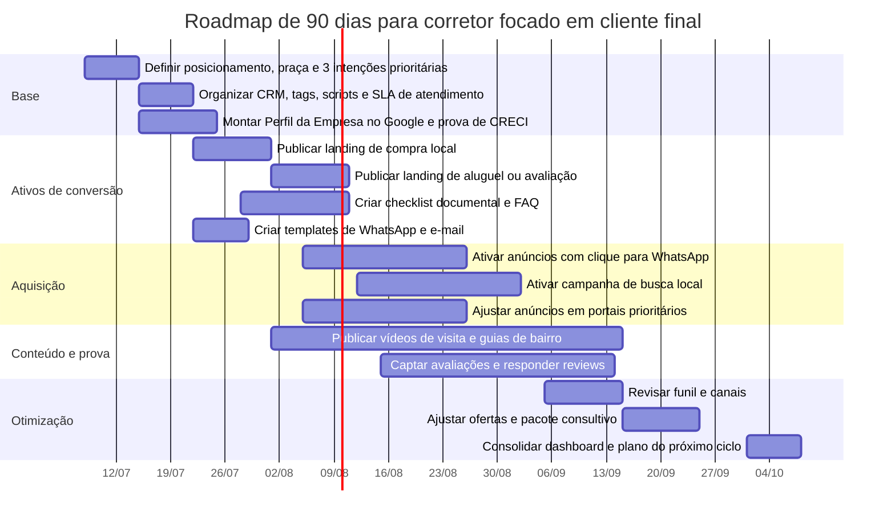

# 2026-07-08 Pesquisa analítica para Corretor de imóveis voltado ao cliente final

Fontes: web e chat; o arquivo `docs/template-blueprint.md` não foi disponibilizado nesta conversa, então o relatório abaixo foi estruturado para preencher esse blueprint com base em fontes públicas brasileiras e premissas explicitadas.

## Resumo executivo

Para cliente final, a porta de entrada da demanda imobiliária no Brasil é majoritariamente orientada ao imóvel e à localização, e não ao “corretor” como primeira busca. Nos principais portais e plataformas, a navegação é centrada em bairro, preço, metragem, quartos, filtros, mapa, elegibilidade para financiamento e contato rápido com o anunciante. Isso sugere que o corretor independente só ganha vantagem real quando reduz fricção onde os portais são mais fracos: filtragem contextual, leitura financeira, segurança documental, coordenação do processo e resposta rápida no WhatsApp. citeturn1search0turn1search1turn1search6turn7search3turn7search16

O contexto macro ainda empurra o cliente final para uma decisão fortemente racional. Em junho de 2026, o Copom reduziu a Selic para 14,25% a.a., e o próprio Banco Central destaca que a Selic influencia financiamentos; ao mesmo tempo, a Abecip informou R$ 16,98 bilhões em financiamentos SBPE em abril de 2026, o melhor abril da série histórica, e o FipeZAP registrou alta média de 0,45% nos preços de venda residencial em junho de 2026, com alta de 2,42% no semestre. Na prática, isso reforça que “cabe no bolso?”, “qual entrada?”, “consigo FGTS?”, “o preço está justo?” e “como evitar erro documental?” precisam estar no centro da proposta comercial do corretor. citeturn15search2turn0search0turn0search5turn16search0

Na concorrência, há três blocos relevantes. Portais como Viva Real, ZAP e OLX vencem por escala, filtros e inventário; plataformas digitais como QuintoAndar e Loft vencem por experiência digital, assinatura e financiamento; imobiliárias tradicionais como Lopes e imobiliárias locais vencem por presença física, confiança, WhatsApp e assessoria completa. O corretor independente precisa se posicionar como “especialista de território + tradutor financeiro-documental + operador de confiança”, não como mero repassador de anúncios. citeturn7search14turn7search6turn1search6turn7search16turn7search9turn7search0turn7search10

Em remuneração, o ponto crítico é clareza contratual. O contrato-padrão do COFECI exige formalização do tipo de contratação, honorários, prazo, documentos e formas de publicidade; o CRECISP publica referências de honorários como 6% a 8% para venda urbana, 1 aluguel para locação por conta do locador e 8% a 10% para administração, mas o próprio sistema COFECI-CRECI alerta que a tabela não deve virar preço único obrigatório, porque a negociação precisa considerar a complexidade concreta do serviço. Por isso, a recomendação comercial mais segura é combinar corretagem contratual clara com camadas opcionais de consultoria e concierge, quando houver valor adicional real para o cliente final. citeturn12view0turn12view1turn9view0turn13view0

Como plano de execução, a combinação mais robusta para 90 dias é: presença local no Google, landings por intenção e bairro, anúncios com clique para WhatsApp, rotinas de resposta rápida, tours em vídeo quando fizer sentido, checklist documental visível, simuladores ou pré-simulação de financiamento, e CRM simples com funil disciplinado. Google orienta o ranking local por relevância, distância e proeminência, e o WhatsApp Business oferece respostas rápidas, etiquetas, mensagens automáticas e catálogo de serviços, o que encaixa diretamente no fluxo do corretor. citeturn3search0turn3search13turn3search5turn4search1turn4search8turn4search9

## Escopo e premissas

Há quatro lacunas estruturais no pedido que afetam a precisão analítica: cidade/região, faixa etária, faixa de renda e faixa de ticket do imóvel. Como você pediu, todas elas foram tratadas como **não especificadas**. Isso importa porque concorrência, liquidez, CPC de mídia, velocidade de fechamento, preço por m² e perfil do comprador variam muito por praça. O relatório, portanto, é um blueprint estratégico nacional, com foco em Brasil e pt-BR, e deve ser regionalizado antes de virar plano operacional definitivo.

| Dimensão | Status | Impacto prático | Como tratar no blueprint |
|---|---|---|---|
| Cidade/região | Não especificada | Impede benchmark local de preço, tempo de venda e concorrentes diretos | Trocar por cidade, bairros-alvo e raio de atuação |
| Faixa etária | Não especificada | Impede mensagem precisa por geração | Coletar no CRM por faixas de idade |
| Faixa de renda | Não especificada | Impede match fino com financiamento e ticket | Coletar renda familiar e entrada disponível |
| Ticket do imóvel | Não especificado | Impede definição de canais e promessa | Definir faixas de preço e tipologias |
| Tipo predominante | Não especificado | Afeta jornada e documentação | Separar usado, novo, lançamento e locação |

Mesmo com essas lacunas, o pano de fundo atual justifica um posicionamento consultivo: o crédito imobiliário segue relevante, mas o cliente final continua pressionado por preço, juros e custos acessórios; em paralelo, o mercado segue digitalizado e orientado por comparação. Isso favorece o corretor que consegue encurtar a busca, destravar financiamento, explicar documentação e gerar confiança verificável. citeturn0search5turn16search0turn15search2turn7search16turn7search9

## Cliente final e jornada

A segmentação mais útil, com as informações disponíveis, é por **objetivo de transação**, porque idade e renda não foram especificadas. Abaixo, a leitura correta não é “perfil demográfico fechado”, mas sim “hipótese de necessidade e mensagem”. Nos portais brasileiros, o comportamento observável é centrado em filtros de busca, comparação por bairro e contato rápido; já as plataformas e imobiliárias reforçam financiamento, avaliação, visita, processo digital e assessoria, o que deixa claro onde o cliente percebe valor. citeturn1search0turn1search1turn1search13turn7search1turn7search9turn7search10

| Segmento por objetivo | Idade no pedido | Renda no pedido | Necessidade principal | Dor dominante | Gatilho de compra | Mensagem que tende a funcionar |
|---|---|---|---|---|---|---|
| Primeira casa | Não especificada | Não especificada | Segurança para decidir e cabimento financeiro | Medo de erro, parcela alta, FGTS, burocracia | Simulação clara + checklist + confiança no processo | “Eu te ajudo a entender entrada, parcela, FGTS e documentos antes da visita.” |
| Upgrade | Não especificada | Não especificada | Mais espaço, melhor bairro, mais conforto | Dúvida entre vender primeiro ou comprar primeiro | Curadoria por bairro + comparativo de custo total | “Filtramos opções reais para sua fase de vida, sem perda de tempo.” |
| Downsizing | Não especificada | Não especificada | Simplificação patrimonial e operacional | Receio de perder valor e mudar mal | Racional de liquidez + adequação de planta e mobilidade | “O objetivo é reduzir custo e esforço, não só trocar de imóvel.” |
| Aluguel | Não especificada | Não especificada | Rapidez, previsibilidade e baixo atrito | Golpes, exigências, documentação, fiador/garantia | Resposta rápida + transparência documental | “Você sabe o que precisa enviar, em que prazo e com qual critério.” |
| Investimento | Não especificada | Não especificada | Retorno, liquidez e risco controlado | Preço, vacância, documentação, saída futura | Análise de localização, renda potencial e risco documental | “Não vendo só o imóvel; mostro o racional da operação.” |

A jornada do cliente final pode ser resumida em três estágios. Na **awareness**, o cliente busca bairro, preço, quartos, metragem, financiamento e filtros; na **consideração**, ele compara adequação financeira, deslocamento, documentação e risco; na **decisão**, ele quer prova de seriedade, agilidade, visitas bem conduzidas e processo sem surpresa. Esse desenho é coerente com a arquitetura dos portais, com o conteúdo dos guias de compra e com os recursos de plataformas digitais. citeturn1search0turn1search1turn1search9turn7search3turn7search12

| Etapa | O que o cliente busca | Pontos de dor e dúvidas | Gatilhos de compra | Ativo recomendado |
|---|---|---|---|---|
| Awareness | Entender oferta e cabimento | “Existe algo no meu bairro e na minha faixa?” “Qual a média?” | Guia local, alertas, mapa, FAQ, financiamento | Landing local por bairro/tipologia, conteúdo de busca, Google Perfil da Empresa |
| Consideração | Reduzir risco de decisão | “Consigo financiar?” “Quais documentos preciso?” “Vai caber?” | Pré-simulação, roteiro de visita, comparativo de opções, prova de CRECI | Checklists, vídeos curtos, simulador, WhatsApp consultivo |
| Decisão | Fechar com menos fricção | “Posso confiar?” “O imóvel está regular?” “Qual o próximo passo?” | Rapidez, documentos claros, proposta assistida, coordenação bancária/jurídica | Script de proposta, cronograma de documentos, follow-up disciplinado |

O fluxo operacional recomendado para o blueprint é este:


Essa jornada favorece conteúdos “people-first”, linguagem local e ativos que respondam exatamente ao que o usuário procura, princípio que o Google reforça nas suas diretrizes de conteúdo útil e SEO. citeturn3search1turn3search12turn3search18

## Oferta, pacotes e concorrência

A oferta mínima confiável do corretor para cliente final precisa combinar mediação comercial, clareza de processo e redução de risco. O contrato-padrão do COFECI para venda, compra e locação inclui formalização de honorários, documentos apresentados e tipos de publicidade permitida, o que mostra que “atendimento informal” é insuficiente para uma operação profissional. Já a Lei nº 6.530/1978 e seu decreto regulamentador situam o corretor como agente de intermediação em compra, venda, permuta e locação. citeturn11view0turn12view0turn0search3turn8search13

| Serviços essenciais | Diferenciais possíveis que aumentam valor percebido |
|---|---|
| Qualificação de necessidade e orçamento | Tour em vídeo e visita virtual |
| Curadoria de imóveis por bairro/tipologia | Pré-simulação de financiamento com apoio bancário |
| Agendamento e condução de visitas | Dossiê de bairro e comparativo de opções |
| Apoio em proposta e negociação | Coordenação com advogado e cartório |
| Checklist documental básico | Atualizações em tempo real por WhatsApp |
| Follow-up com próximo passo claro | Pós-venda de 30 dias |
| Prova de regularidade profissional e transparência | Conteúdo educativo personalizado por fase da jornada |

Em precificação, é melhor separar **corretagem** de **serviços consultivos adicionais**. A referência do CRECISP para venda urbana é de 6% a 8%; para locação, o equivalente a 1 aluguel por conta do locador; para administração de imóveis, 8% a 10%. Ao mesmo tempo, o manual de conformidade do COFECI-CRECI é explícito ao dizer que a negociação de comissão deve considerar a complexidade concreta do serviço e que uniformizar preços prejudica a concorrência e o consumidor. Em outras palavras: use a tabela como referência, não como preço cego. citeturn9view0turn13view0

A tabela abaixo é uma **proposta comercial sugerida pelo relatório**, e não uma tabela oficial obrigatória.

| Modelo de oferta | Quem paga | Escopo | Faixa sugerida | Observação |
|---|---|---|---|---|
| Corretagem padrão de venda | Normalmente vendedor/proprietário | Intermediação, visitas, proposta, checklist e fechamento | **6% a 8%** sobre a venda | Baseada na referência CRECISP; formalizar no contrato |
| Corretagem padrão de locação | Normalmente locador | Divulgação, atendimento, visitas, proposta, contrato | **1 aluguel** | Baseada na referência CRECISP |
| Buyer advisory opcional | Comprador/investidor | Diagnóstico, shortlist, pré-simulação, visita guiada, checklists | **R$ 1.500 a R$ 3.000** | Pode ser abatido da corretagem se fechar |
| Concierge premium | Comprador, investidor ou família | Tudo do buyer advisory + jurídico/cartório/banco + pós-venda | **R$ 4.000 a R$ 8.000** | Só faz sentido quando há alto valor percebido |
| Gestão de locação | Proprietário | Administração recorrente e cobrança | **8% a 10%** da receita | Referência de administração imobiliária |

Na concorrência, a comparação mais útil é por canal e proposta de valor.

| Bloco concorrencial | Canais dominantes | Proposta de valor observável | Prática de precificação | Onde o corretor independente pode ganhar |
|---|---|---|---|---|
| Portais | Viva Real, ZAP, OLX | Escala, filtros, comparação rápida, mapa, grande estoque | Para o cliente final, o acesso costuma ser gratuito; monetização é indireta, do lado do anunciante/plataforma | Curadoria humana, contexto local, pós-clique e follow-up real |
| Plataformas digitais | QuintoAndar, Loft | Processo digital, visita agendada, assinatura, financiamento, menos burocracia | Receita combinada via intermediação e serviços digitais | Atendimento mais personalizado e nichado por território |
| Imobiliárias tradicionais | Lopes, redes locais | Presença física, equipe, WhatsApp, portfólio, “assessoria completa” | Comissão, administração, eventual fee de serviços | Agilidade, especialização e operação mais enxuta |
| Corretor autônomo sem posicionamento | Instagram/WhatsApp/portais | Atendimento individual, mas muitas vezes genérico | Preço pouco claro ou dependente de boca a boca | Precisa virar especialista e não apenas “mais um contato” |

Essa síntese está alinhada ao que os portais declaram sobre filtros e busca, ao que QuintoAndar e Loft destacam sobre experiência digital e financiamento, e ao que redes tradicionais e imobiliárias locais mostram em termos de atendimento e WhatsApp. citeturn1search0turn1search1turn1search6turn7search16turn7search2turn7search9turn7search0turn7search10turn7search4

## Marketing e aquisição

Os canais mais eficazes para cliente final são os que capturam intenção já existente e reduzem atrito até a conversa: SEO local, Perfil da Empresa no Google, anúncios pagos com clique para WhatsApp, presença mínima em portais, vídeos/tours e rotinas de WhatsApp Business. Google afirma que o ranking local depende principalmente de relevância, distância e proeminência; além disso, o Perfil da Empresa oferece métricas de visualizações, cliques e interações, e o Google recomenda solicitar avaliações com link ou QR code. Isso faz do Google um canal central para o corretor local. citeturn3search0turn3search13turn3search5turn3search9

O SEO do corretor precisa ser menos institucional e mais orientado a intenção real de busca. Em vez de páginas genéricas do tipo “sobre mim”, o melhor formato tende a ser página por bairro, tipologia e problema resolvido: “apartamento 2 quartos em [bairro]”, “como usar FGTS para comprar imóvel”, “documentos para comprar imóvel”, “morar em [bairro]” e “imóveis que cabem na sua renda”. Isso é coerente com a orientação do Google de usar as palavras que as pessoas realmente procuram em títulos, headings e conteúdo útil, e também com a estrutura de descoberta dos grandes portais. citeturn3search12turn3search18turn1search0turn1search1turn7search3

O WhatsApp deve ser tratado como o principal ambiente de conversão, não como canal improvisado. O WhatsApp Business oferece respostas rápidas, etiquetas, mensagens automáticas e catálogo; a própria documentação da plataforma orienta criar quick replies, organizar leads por listas/labels e usar anúncios que levem à conversa. Para corretor, isso significa ter no mínimo etiquetas como “lead novo”, “pré-aprovado”, “visita agendada”, “proposta enviada” e “pós-venda”. citeturn4search1turn4search8turn4search9turn4search7

| Canal ou tática | Melhor uso | Conteúdo recomendado | KPI principal | Meta inicial sugerida |
|---|---|---|---|---|
| Perfil da Empresa no Google | Captura local e prova de confiança | Fotos reais, bairro atendido, CRECI, horário, link de WhatsApp, avaliações | Ligações, cliques no site, mensagens, rotas | Perfil completo + 10 avaliações reais no ciclo |
| Landing pages locais | Busca orgânica e mídia paga | Página por bairro/intenção, FAQ, checklist, CTA | Sessões orgânicas, leads, taxa de conversão | 3 páginas prioritárias no ciclo |
| Google Ads | Fundo de funil | Termos por bairro + intenção de compra/aluguel | CPL, taxa de conversa no WhatsApp | Começar com grupos pequenos por bairro |
| Meta Ads com clique para WhatsApp | Descoberta e reativação | Reels curtos, carrosséis, tour, “cabe no bolso?” | Custo por conversa, resposta em 5 min | Rodar 2 a 3 criativos por campanha |
| Portais | Higiene competitiva | Anúncios completos, fotos boas, descrição útil | Leads recebidos, visitas e propostas | Manter anúncios-chave sempre ativos |
| Tour em vídeo | Quebra de objeção e pré-qualificação | Vídeo de visita, entorno e pontos fortes | Taxa de visita agendada por lead | Usar nos imóveis com maior volume de leads |

Os tipos de conteúdo mais eficazes mudam por etapa da jornada. No topo, funcionam guias de bairro, custo total da compra, FGTS, erros comuns e glossário; no meio, comparativos de opções, matrizes de decisão, vídeos de visita, documentação e financiamento; no fundo, prova social, cronograma real do processo, disponibilidade atualizada e CTA imediato para WhatsApp. O próprio Google orienta conteúdo útil, confiável e orientado à experiência da pessoa — não à manipulação do ranking. citeturn3search1turn3search18turn7search12turn7search8

## Operação, riscos e documentação

Para cliente final, processo é produto. Quanto mais opaco o processo, mais o corretor parece substituível. Já o contrato-padrão do COFECI reforça elementos operacionais concretos — documentos, publicidade permitida, honorários, prazo e forma de contratação — e a documentação da CAIXA mostra que financiamento e uso do FGTS exigem preparação documental objetiva do cliente e do imóvel. citeturn11view0turn12view0turn5search0turn5search1turn5search4turn5search13

| Etapa operacional | SLA sugerido | Ferramenta simples | Critério de passagem |
|---|---|---|---|
| Primeiro contato | até 5 minutos em horário comercial | WhatsApp Business | Lead respondeu e informou intenção |
| Qualificação | no mesmo dia | Formulário curto + CRM | Bairro, faixa de preço, prazo, renda, entrada |
| Pré-análise financeira | D0 a D1 | Simulação + checklist | Cliente sabe teto de parcela e entrada |
| Curadoria de opções | D1 a D3 | Planilha ou CRM | Máximo de 3 a 5 opções aderentes |
| Visita | D2 a D7 | Agenda compartilhada | Cliente confirmou presença e roteiro |
| Proposta | até 24h após imóvel escolhido | Template de proposta | Valor, prazo, condição e documentação |
| Documentação | imediatamente após aceite | Checklist por transação | Pasta completa por parte |
| Fechamento | conforme banco/cartório | Cronograma compartilhado | Assinatura e registro ou contrato |
| Pós-venda | D+1, D+7, D+30 | Sequência de mensagens | Pedido de avaliação e indicação |

Em documentação, o divisor de águas é distinguir bem compra à vista, compra financiada, locação e investimento. Na compra e venda, o ponto jurídico central é que a escritura documenta a operação, mas o registro no Cartório de Registro de Imóveis é o que transfere efetivamente a propriedade; na locação, a espinha legal continua sendo a Lei do Inquilinato; no financiamento, a CAIXA lista documentação básica do comprador, do vendedor e do imóvel, e também condições específicas para uso do FGTS. citeturn5search7turn5search11turn5search15turn5search2turn5search0turn5search4turn5search1turn5search27

| Tipo de transação | Documentos do cliente | Documentos da outra parte | Documentos do imóvel | Pontos de atenção |
|---|---|---|---|---|
| Compra à vista | RG/CPF, estado civil, comprovante de endereço e de origem dos recursos | RG/CPF ou CNPJ, estado civil, poderes de representação | Matrícula atualizada, certidões pertinentes, IPTU, regularidade do imóvel | Conferir ônus, inventário, capacidade das partes e necessidade de escritura |
| Compra financiada | Identificação, comprovantes de renda, estado civil, FGTS se aplicável | Identificação, estado civil, dados do vendedor | Matrícula atualizada, certidão de inteiro teor, dados do imóvel exigidos pelo banco | Prestação x renda, enquadramento do imóvel, uso do FGTS e prazos bancários |
| Locação | Identificação, renda, comprovante de residência, dados da garantia | RG/CPF ou CNPJ do locador ou imobiliária | Dados do imóvel, condições de locação, encargos | Garantia locatícia, golpe da fiança, transparência de encargos |
| Compra para investimento | Identificação, capacidade financeira, tese de retorno/liquidez | Idem compra | Idem compra + análise de liquidez e saída | Vacância, preço relativo, custos ocultos e liquidez futura |

Em risco e objeção, a base do script deve ser sempre prova, não improviso. CRECI-RJ recomenda que o cliente peça a cédula profissional e verifique a regularidade do corretor; o CRECISP mantém busca por corretores e canais de denúncia; e o próprio conselho tem alertas públicos sobre golpes imobiliários, falsa intermediação e golpe da fiança. Ao mesmo tempo, formulários e CRM precisam respeitar a LGPD, com finalidade clara e coleta proporcional. citeturn2search5turn2search2turn2search9turn10search4turn10search1turn10search6turn6search0turn6search1

| Objeção comum | Resposta-base recomendada | Prova que acompanha |
|---|---|---|
| “Ainda estou só pesquisando.” | “Perfeito. Então meu papel agora não é te vender um imóvel, e sim te ajudar a entender faixa de preço, entrada e documentação para você pesquisar melhor.” | Checklist simples + conteúdo de custo total |
| “Tenho medo de golpe.” | “Faz sentido. Você pode validar meu registro no CRECI, e antes de qualquer avanço eu te mostro a matrícula e o passo documental da operação.” | Link de verificação CRECI + checklist documental |
| “Portal já resolve.” | “Portal ajuda a encontrar oferta; eu entro para reduzir ruído, evitar visita fora do perfil e antecipar o financeiro e o documental.” | Matriz comparativa de 3 opções + roteiro de visita |
| “Não sei se cabe no meu bolso.” | “Vamos começar pelo teto de parcela, entrada e uso possível do FGTS. Sem isso, visitar imóvel costuma desperdiçar tempo.” | Pré-simulação e checklist CAIXA |
| “Não quero mandar meus dados.” | “Você pode enviar só o mínimo necessário para a etapa atual. Eu explico a finalidade de cada dado e avanço por etapas.” | Texto curto de privacidade/LGPD |
| “Preciso falar com a família.” | “Ótimo. Posso te mandar um resumo com preço, custos, documentação e principais riscos para a decisão ficar objetiva.” | Resumo de decisão em 1 página |

Abaixo, três templates prontos para copiar e colar.

**Template de e-mail de follow-up**

```text
Assunto: Resumo objetivo das opções em [bairro/região]

Olá, [nome].

Separei [3] opções dentro do perfil que você comentou, considerando:
- faixa de preço
- tipologia
- localização
- possibilidade de financiamento/FGTS, quando aplicável

Se fizer sentido, eu também posso te mandar um resumo com:
1. custo estimado de entrada
2. faixa de parcela
3. documentos iniciais
4. próximos passos para visita

Se preferir, seguimos por WhatsApp para agilizar.

Abraço,
[nome]
[CRECI]
[telefone]
```

**Template de WhatsApp de primeiro atendimento**

```text
Olá, [nome]. Sou [nome], corretor(a) de imóveis, CRECI [número].

Para eu te ajudar sem te fazer perder tempo, me responde só 4 pontos:
1. você quer comprar, alugar ou investir?
2. qual bairro ou região faz mais sentido?
3. qual faixa de valor ou parcela confortável?
4. em quanto tempo você pretende decidir?

Com isso eu já te mando opções mais aderentes e os próximos passos certos.
```

**Roteiro de visita**

```text
Antes da visita
- confirmar objetivo da visita
- confirmar orçamento e prazo
- mandar localização, horário e duração estimada

Durante a visita
- validar planta, iluminação, ventilação e ruído
- checar circulação, elevador, vaga, condomínio e entorno
- perguntar o que precisa permanecer e o que não serve
- registrar dúvidas documentais e financeiras

Depois da visita
- enviar resumo em até 24h
- classificar: aderente, aderente com ressalvas, não aderente
- combinar próximo passo: nova visita, proposta ou descarte
```

## Métricas, dashboard e implementação

Sem cidade/região e sem mix de produto definidos, **tempo médio de venda de benchmark externo deve ser tratado como não especificado**. O mais correto aqui é medir baseline interno desde o primeiro dia. Já para metas de operação enxuta, faz sentido começar com indicadores controláveis: tempo de resposta, taxa de qualificação, taxa de visita, taxa de proposta e taxa de fechamento. Google mostra métricas de interações do Perfil da Empresa, e o WhatsApp Business ajuda a organizar respostas e estágios, o que torna esse stack suficiente para um dashboard inicial. citeturn3search13turn4search1turn4search8

| Indicador | O que mede | Meta inicial sugerida para 90 dias |
|---|---|---|
| Tempo de primeira resposta | Velocidade comercial | até 5 min em horário comercial |
| Taxa de qualificação | % de leads com bairro + objetivo + faixa + prazo | 60% ou mais |
| Taxa de agendamento de visita | % de leads qualificados que agendam | 25% a 40% |
| Taxa de comparecimento | % de visitas agendadas que acontecem | 70% ou mais |
| Taxa de proposta | % de visitas que viram proposta | 10% a 20% |
| Taxa de fechamento | % de propostas que fecham | 20% a 35% |
| Origem por lead | Qual canal traz lead qualificado | medir por canal desde o dia 1 |
| Tempo até visita | Velocidade entre lead e visita | até 7 dias |
| Tempo até fechamento | Duração do ciclo real | medir baseline, sem benchmark externo fixo |

O dashboard inicial pode ser simples, em planilha ou CRM leve.

| Dashboard | Visualizações mínimas | Frequência |
|---|---|---|
| Aquisição | leads por canal, CPL, conversas iniciadas | semanal |
| Funil | lead > qualificado > visita > proposta > fechamento | semanal |
| Atendimento | tempo de resposta, pendências, follow-ups vencidos | diário |
| Financeiro | VGV potencial, comissão prevista, comissão fechada | semanal |
| Conteúdo | posts, acessos, leads por página, avaliações recebidas | quinzenal |

Para implementação, a recomendação é um ciclo de 90 dias com foco em ativos mínimos viáveis, não em estrutura pesada.

| Papel | Dedicação estimada | Responsabilidade |
|---|---|---|
| Corretor(a) principal | 15 a 20 h/semana | atendimento, visitas, conteúdo de campo, follow-up |
| Operação/estratégia | 6 a 8 h/semana | páginas, CRM, métricas, melhoria de processo |
| Design/web | 8 a 16 h no primeiro mês | landing pages, criativos e materiais |
| Tráfego pago | 3 a 5 h/semana a partir do segundo mês | campanhas e otimização |
| Jurídico/documental | sob demanda | revisão pontual e orientação de fechamento |

Cronograma sugerido:



Os marcos mais importantes do ciclo são estes:

| Marco | Resultado esperado |
|---|---|
| Dia 15 | CRM pronto, scripts prontos, Perfil da Empresa publicado |
| Dia 30 | Primeira landing publicada, FAQ e checklist no ar |
| Dia 45 | Mídia paga ativa e rotina de atendimento estabilizada |
| Dia 60 | Conteúdo recorrente, avaliações captadas, funil mensurável |
| Dia 90 | Relatório com canais vencedores, gargalos do processo e decisão sobre expansão |

A recomendação final é objetiva: para cliente final, o corretor não deve vender “atenção”, mas **clareza**. O posicionamento com melhor chance de funcionar, dado o mercado observado, é “especialista local que encurta a busca, traduz financiamento e protege a operação documental”. Isso conversa melhor com o que os portais já fazem bem, com o que os clientes finais realmente pesquisam e com a forma como Google, WhatsApp e as principais plataformas estruturam a jornada. citeturn1search0turn1search1turn7search16turn7search9turn3search0turn4search8
