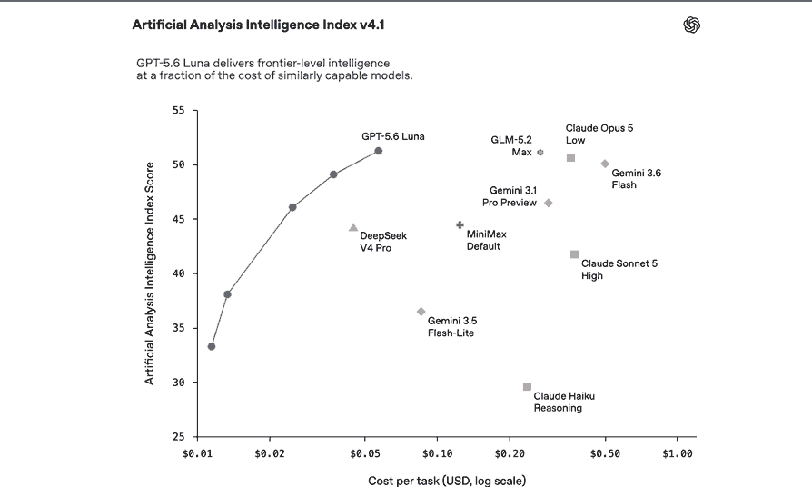

# OpenAI Model Snapshot — LP Factory 10

## 1. Objetivo e validade

- Data do snapshot: 13/08/2026.
- Objetivo: manter uma fotografia curta e datada para decisões de custo-desempenho de modelos e para avaliação de capacidades de execução dos workloads OpenAI do LP Factory 10.
- Este documento compara candidatos; não define sozinho o modelo em produção e não autoriza migração, implementação ou mudança de arquitetura.
- A configuração efetivamente adotada continua registrada em `docs/platform-config.md`; a governança da decisão continua em `docs/gestor-automations.md`.
- Preços, modelos, capacidades e parâmetros são voláteis. Antes de qualquer decisão, reconfirmar os valores nas fontes oficiais atuais e atualizar este snapshot quando houver mudança material.
- Fontes oficiais iniciais:
  - `https://developers.openai.com/api/docs/guides/latest-model`
  - `https://developers.openai.com/api/docs/models`
  - `https://developers.openai.com/api/docs/models/gpt-5.4-mini`
  - `https://developers.openai.com/api/docs/models/gpt-5.6-luna`
  - `https://developers.openai.com/api/docs/models/gpt-5.6-terra`
  - `https://developers.openai.com/api/docs/models/gpt-5.6-sol`
  - `https://developers.openai.com/api/docs/guides/reasoning`
  - `https://openai.github.io/openai-agents-js/`
  - `https://openai.com/pt-BR/index/gpt-5-6/`
  - `https://openai.com/pt-BR/index/advancing-the-price-performance-frontier-with-gpt-5-6/`

## 2. Baseline atual do projeto

### 2.1 Workloads registrados

- `niche_resolution` → configuração efetiva atual `gpt-5.4-mini + none`.
- `landing_page_generation_profile_proposal` → configuração efetiva atual `gpt-5.4-mini + none`.
- `commercial_activation_draft_generation` → configuração efetiva atual `gpt-5.4-mini + none`.
- Fonte de configuração efetiva: `lib/openai-workloads/registry.ts`, com `configurationSource: repo_catalog` e revisão `v1`, conforme a governança da E21.1.
- Fonte operacional: `docs/platform-config.md`.
- Variáveis legadas de modelo não são fonte runtime atual; seu estado operacional permanece exclusivamente em `docs/platform-config.md`.

### 2.2 Regra de baseline

- `gpt-5.4-mini + none` permanece como baseline validada dos três workloads de produto já registrados, até decisão específica por workload.
- Novo workload exige decisão explícita de `modelo + reasoning effort`; a configuração dos workloads existentes é baseline comparativa, não default universal.
- O effort efetivamente usado deve ser confirmado na requisição real antes de cada comparação; não inferir configuração apenas pelo modelo.
- Na documentação atual da OpenAI, `gpt-5.4-mini` suporta `none`, `low`, `medium`, `high` e `xhigh`, com `none` como padrão quando o parâmetro é omitido.

## 3. Snapshot de modelos e custos

### 3.1 Preços e capacidades principais

| Modelo | Papel de referência | Input / 1M | Cached input / 1M | Output / 1M | Contexto | Saída máx. | Reasoning effort |
|---|---|---:|---:|---:|---:|---:|---|
| `gpt-5.4-mini` | baseline atual | US$ 0,75 | US$ 0,075 | US$ 4,50 | 400k | 128k | `none`, `low`, `medium`, `high`, `xhigh` |
| `gpt-5.6-luna` | custo/alto volume | divergente* | divergente* | divergente* | 1,05M | 128k | `none`, `low`, `medium`, `high`, `xhigh`, `max` |
| `gpt-5.6-terra` | equilíbrio inteligência/custo | divergente* | divergente* | divergente* | 1,05M | 128k | `none`, `low`, `medium`, `high`, `xhigh`, `max` |
| `gpt-5.6-sol` | maior capacidade / trabalho complexo | US$ 5,00 | US$ 0,50 | US$ 30,00 | 1,05M | 128k | `none`, `low`, `medium`, `high`, `xhigh`, `max` |

- Luna, Terra e Sol suportam Responses API, function calling, Structured Outputs e reasoning tokens.
- A orientação oficial atual posiciona Luna para workloads sensíveis a custo e volume, Terra para equilíbrio entre inteligência e custo e Sol para maior capacidade em trabalho profissional complexo.
- Em GPT-5.6, o effort padrão é `medium` quando omitido. Portanto, comparações devem sempre registrar o effort explicitamente.

#### 3.1.1 Divergência temporária de preços do Luna e do Terra

- Em consulta realizada em 11/08/2026, fontes oficiais atuais da OpenAI apresentam valores conflitantes para Luna e Terra.
- O anúncio oficial de 30/07/2026 informa, a partir daquela data: Luna a US$ 0,20 por 1M tokens de entrada e US$ 1,20 por 1M tokens de saída; Terra a US$ 2,00 por 1M tokens de entrada e US$ 12,00 por 1M tokens de saída.
- As páginas oficiais atuais dos modelos exibem: Luna a US$ 1,00 de entrada, US$ 0,10 de cached input e US$ 6,00 de saída; Terra a US$ 2,50 de entrada, US$ 0,25 de cached input e US$ 15,00 de saída.
- Enquanto essa divergência permanecer, este snapshot não declara nenhum dos dois conjuntos como preço operacional definitivo e não deve usar Luna ou Terra em cálculo financeiro decisório baseado apenas nesses valores publicados.
- Antes de comparar custo financeiro real de Luna ou Terra, reconfirmar o preço efetivamente aplicável em fonte oficial vigente e, quando possível, confrontar com a cobrança/uso efetivo do ambiente autorizado.
- A divergência de preço não invalida benchmarks qualitativos de capacidade ou custo-desempenho, mas impede inferir razões precisas de economia entre Luna, Terra e outros modelos até a reconfirmação.

### 3.2 Como o effort afeta custo

- O nível de `reasoning.effort` não cria uma tarifa por token diferente para o mesmo modelo.
- O effort pode alterar a quantidade de reasoning tokens, a latência e o custo total da chamada.
- Reasoning tokens são cobrados como output tokens e aparecem em `usage.output_tokens_details.reasoning_tokens`.
- A unidade correta de comparação é `workload + modelo + effort`, e não apenas o nome do modelo.
- Para GPT-5.6, prompts acima de 272k tokens de entrada têm multiplicadores de preço informados nas páginas atuais dos modelos; confirmar a regra vigente quando o workload puder atingir essa faixa.
- O modo Fast do GPT-5.6 Sol é uma opção separada de latência: o anúncio de 30/07/2026 informa até 2,5x mais velocidade pelo dobro do preço do processamento Standard, sem mudança de inteligência. Não tratar Fast como padrão.

### 3.3 Fórmula mínima de custo

- Entrada comum: `(input_tokens - cached_tokens) × tarifa_input`.
- Entrada cacheada: `cached_tokens × tarifa_cached_input`.
- Saída total: `output_tokens × tarifa_output`.
- `output_tokens` inclui os reasoning tokens contabilizados pela API.
- Custo total estimado: soma das três parcelas, acrescida de custos de tools ou modos especiais quando aplicáveis.
- Enquanto a divergência da seção 3.1.1 estiver ativa, não aplicar esta fórmula a Luna ou Terra como base de decisão financeira sem reconfirmar previamente as tarifas efetivamente aplicáveis.

### 3.4 Evidência externa de preço-desempenho

- Fonte: OpenAI, página oficial do GPT-5.6, com referência ao `Artificial Analysis Intelligence Index v4.1`: `https://openai.com/pt-BR/index/gpt-5-6/`.
- O índice é apresentado como uma medida ampla de inteligência que combina trabalho agentic, programação, raciocínio científico e capacidades gerais; portanto, serve como evidência externa de eficiência geral, não como benchmark específico da LP Factory.
- No gráfico, os pontos do GPT-5.6 Luna ocupam uma faixa de custo por tarefa substancialmente menor enquanto a pontuação aumenta com mais computação, reforçando Luna como candidato prioritário quando custo-desempenho for material.
- O gráfico não identifica cada ponto do Luna por `reasoning.effort`; não inferir que um ponto corresponde a `medium`, `high`, `xhigh` ou `max` sem evidência específica.
- O benchmark não substitui a comparação representativa do workload prevista na seção 4.1 nem autoriza promover Luna, `xhigh` ou qualquer outra combinação por padrão.

## 4. Comparação por workload e registro de resultados

### 4.1 Protocolo mínimo

- Usar o mesmo conjunto de tarefas representativas e os mesmos gates de validade para comparar candidatos.
- Preservar o modelo atual como baseline até existir evidência suficiente para substituí-lo.
- Novo workload não herda automaticamente modelo ou effort de outro workload; a primeira configuração deve ser uma hipótese explícita e comparável contra baseline e candidatos pertinentes.
- Para GPT-5.6, testar `reasoning.effort` explicitamente; usar esforço maior somente quando houver ganho de qualidade mensurável.
- Registrar por execução: workload, modelo, effort, modo quando aplicável, resultado válido, critério de qualidade, `input_tokens`, `cached_tokens`, `output_tokens`, `reasoning_tokens`, latência e custo estimado.
- Escolher a combinação mais simples e econômica que cumpra o resultado, a qualidade, a segurança e a latência exigidos pelo workload.
- Não generalizar o vencedor de um workload para outro.

### 4.2 Workloads iniciais para comparação

| Workload | Baseline atual | Candidatos de referência | Resultado vigente |
|---|---|---|---|
| resolvedor IA de nicho | `gpt-5.4-mini + none` | Luna / Terra / Sol + effort aplicável | não comparado neste snapshot |
| perfil de orientação de landing page | `gpt-5.4-mini + none` | Luna / Terra / Sol + effort aplicável | não comparado neste snapshot |
| ativação comercial | `gpt-5.4-mini + none` | Luna / Terra / Sol + effort aplicável | não comparado neste snapshot |

### 4.3 Registro de decisão

- Quando houver teste real, registrar somente o resumo necessário para reproduzir a decisão: data, workload, baseline, combinações comparadas, gates, métricas principais e combinação vencedora.
- Resultados detalhados ou evidências extensas devem permanecer no PR ou artefato do recorte; este documento mantém apenas o snapshot decisório.
- Se preços ou capacidades mudarem, atualizar a seção 3 sem apagar decisões históricas já sustentadas por testes; marcar a data da nova fotografia.

## 5. Laboratório futuro de avaliação de custo-benefício

### 5.1 Finalidade

- Preservar como capacidade futura um laboratório de avaliação que substitua escolhas intuitivas de configuração por decisões baseadas em evidência para cada workload real.
- A unidade mínima de comparação continua sendo `workload + modelo + reasoning effort`, conforme a seção 3.2; não comparar apenas nomes de modelos.
- Exemplos conceituais de combinações comparáveis incluem `GPT-5.6 Luna + medium`, `GPT-5.6 Luna + xhigh`, `GPT-5.6 Terra + medium`, `GPT-5.6 Terra + high`, `GPT-5.6 Sol + medium` e `GPT-5.6 Sol + high`, sem transformá-las em candidatos permanentes ou preferência antecipada.
- O laboratório também deve permitir à governança do projeto distinguir se um problema observado de entrega está principalmente em modelo/effort, contexto, contrato de saída, uso de tools, continuidade, eficiência de contexto ou necessidade real de orquestração agentic.
- Princípio de decisão: medir antes de promover uma combinação de modelo + effort ou uma capacidade de execução como configuração preferencial.

### 5.2 Métricas e método

- O laboratório deverá aplicar o protocolo da seção 4.1 e as regras de custo das seções 3.2 e 3.3 sobre a mesma tarefa representativa, mantendo constantes as demais variáveis sempre que possível.
- Para cada combinação testada, avaliar: qualidade da entrega, taxa de sucesso, necessidade de correção humana, `input_tokens`, `cached input tokens` quando aplicável, `output_tokens`, `reasoning_tokens`, custo financeiro efetivo, latência e estabilidade/repetibilidade.
- O preço unitário dos tokens é determinado pelo modelo; alterar o reasoning effort não cria tarifa unitária própria.
- Effort maior pode produzir mais reasoning/output tokens e, portanto, elevar o custo financeiro total; também pode aumentar a latência.
- Reasoning tokens fazem parte dos output tokens e não constituem uma terceira tarifa independente.

| Configuração conceitual | Qualidade | Custo | Latência |
|---|---|---|---|
| Luna + medium | medir | medir | medir |
| Luna + xhigh | medir | medir | medir |
| Terra + medium | medir | medir | medir |
| Terra + high | medir | medir | medir |
| Sol + medium | medir | medir | medir |
| Sol + high | medir | medir | medir |

### 5.3 Perguntas de decisão

- O ganho de `high` ou `xhigh` sobre `medium` justifica custo e espera adicionais?
- Luna + xhigh entrega a qualidade exigida antes de escalar para Terra ou Sol?
- Terra + high entrega resultado equivalente a Sol + medium por custo menor?
- Quais workloads realmente precisam de configurações mais fortes?
- Quais workloads podem operar com modelos ou esforços mais econômicos sem perder os gates exigidos?

### 5.4 Escopo e limites

- Esta seção registra somente uma capacidade futura de avaliação; não representa laboratório já implementado.
- Não define banco, tabela, rota, dashboard, job, engine, agente, automação, migration, código de benchmarking ou nova infraestrutura.
- A forma de implementação do laboratório permanece em aberto para decisão futura baseada no recorte que vier a planejá-lo.
- O escopo atual deste documento permanece nos workloads do produto/API. Codex App, tasks e custom agents podem ser extensão futura do conceito, mas seu consumo e sua cobrança não devem ser tratados como equivalentes aos custos da API sem verificação específica.

### 5.5 Governança e fonte dinâmica

- O laboratório deve apoiar decisões futuras por workload; não transforma um modelo em padrão universal, `high`, `xhigh` ou `max` em effort padrão nem o modelo mais caro em escolha automática para tarefas críticas.
- Não manter nesta seção catálogo permanente de preços, modelos disponíveis, efforts, parâmetros ou capacidades específicas da API; esses elementos permanecem voláteis conforme a seção 1.
- Quando o laboratório vier a ser planejado ou implementado, consultar a documentação oficial vigente da OpenAI, preferencialmente via `$openai-docs` no Codex.
- O registro interno deve preservar principalmente objetivo, critérios, método, métricas e princípios de decisão.

### 5.6 Recursos candidatos à experimentação

- `Responses API` direta, combinada com backend determinístico quando a sequência do processo já for conhecida, permanece como referência de menor complexidade para comparação.
- Structured Outputs é candidato quando o problema principal for controlar a forma e o contrato da saída; JSON ou schema válido não deve ser tratado como garantia de factualidade ou qualidade editorial.
- Tool calling é candidato quando o modelo precisar escolher e acionar capacidades externas autorizadas; uma fonte consultada pelo backend não se torna tool apenas por participar do contexto.
- Programmatic Tool Calling é candidato para workflows delimitados e intensivos em tools quando houver hipótese de ganho por coordenar chamadas e resultados intermediários; comparar sucesso, completude, tokens, latência, custo e complexidade contra o fluxo de referência.
- Persisted reasoning é candidato para etapas relacionadas em que preservar continuidade cognitiva do modelo possa melhorar qualidade ou eficiência; não substitui estado verificável de negócio ou processo.
- Explicit prompt caching é candidato quando prefixos estáveis e repetidos do contexto puderem ser reutilizados com benefício mensurável; não é pausa de workflow nem memória escolhida pelo modelo.
- Multi-agent é candidato para trabalhos complexos que se decomponham de forma limpa em frentes independentes e possam se beneficiar de execução paralela e síntese; não presumir benefício quando as etapas forem fortemente dependentes entre si.
- Agents SDK deve ser avaliado separadamente como framework de orquestração agentic quando houver benefício concreto em delegar ao runtime gestão de turns, tools, guardrails, handoffs, sessions ou tracing; não é evolução automática de um workflow baseado em Responses API.
- A disponibilidade, suporte por modelo, parâmetros e comportamento desses recursos são voláteis e devem ser reconfirmados na documentação oficial vigente antes de cada experimento.

### 5.7 Ambientes e progressão dos testes

- Primeiro compreender conceitualmente o recurso e observar o que a aplicação envia, o que a plataforma executa e o que retorna na requisição.
- Quando útil, realizar experimento isolado fora do runtime da LP Factory, em ambiente a ser definido no recorte do teste, sem criar por esta seção infraestrutura permanente.
- Comparar o recurso contra uma baseline explícita usando a mesma tarefa representativa e mantendo constantes as demais variáveis sempre que possível.
- Testar inicialmente um recurso ou variável por vez quando isso for suficiente para atribuir causa ao ganho ou à regressão observada.
- Somente depois de evidência isolada suficiente, avaliar combinações de recursos aprovados e medir novamente o conjunto.
- Um resultado positivo em simulação não autoriza automaticamente adoção no runtime; o workload real deve justificar o teste e a promoção.
- O resultado possível de cada avaliação é adotar, rejeitar ou preservar o recurso como oportunidade condicional para novo teste quando houver gatilho objetivo.

### 5.8 Regra de promoção

- A sequência de decisão deve ser: problema observado → hipótese de causa → recurso ou configuração candidata → teste representativo → métricas → decisão.
- Nenhum recurso se torna padrão por novidade, sofisticação ou por estar disponível no modelo mais capaz.
- A promoção exige benefício demonstrável nos gates relevantes do workload, considerando qualidade, taxa de sucesso, intervenção humana, custo, latência, estabilidade e, quando material, segurança, manutenção e complexidade operacional.
- O recurso mais simples que cumpra os gates permanece preferível a uma arquitetura mais sofisticada sem ganho mensurável.
- A governança deve produzir evidência compreensível para decisão de produto sem exigir que o proprietário domine a implementação do código; detalhes técnicos permanecem responsabilidade do recorte de implementação.
